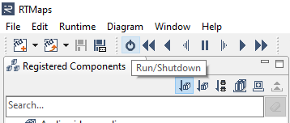

# dSPACE Smart Tagging
Smart Tagging is a collection of RTMaps diagrams which deploy neural network based algorithms, e.g. for object detection.

## RTMaps
RTmaps is a highly-optimized component-based development and execution software tool ideal to simulate and control data flow, such as video streams.
- RTMaps full version (trial) is available at https://intempora.com/products/rtmaps/
- RTMaps for students is available for free at https://intempora.com/products/rtmaps/rtmaps-for-students/

## Current model
Our current model is a YOLOv3 trained on A2D2 without mixed-precision.

## Requirements
The following software is required to be able to run the code:

### Windows
- RTMaps 4.9.0 for Windows
   - rtmaps_python_bridge 4.1.10
   - rtmaps_image_processing_miscellaneous 2.1.6

### Linux
- RTMaps 4.8.0 for Linux
   - rtmaps_python_bridge 3.0.4
   - rtmaps_image_processing_miscellaneous 2.1.6

### Python and Python Packages
- Python 3.8

(If you install the package as described below, the Python dependencies will be taken care of automatically.)
- tensorflow == 2.4.x
- requests >= 2.27.0

**Important: Using virtual or conda environments in combination with RTMaps is currently not possible.**

## Build & Installation
In order to use this repository, it has to be installed as a python package.
Either as an editable installation or using a fixed package.
Due to their file size, we did not include model files and sample data in this repository.
The necessary data will be automatically downloaded on first import of the module.

### Recommended: Installation as editable package
Download or clone the repository to a location of your choice and run

```bash
cd <PATH TO REPO DIR> && pip install -e .
```

in order to install an editable version of the package.

### Download weights and sample data
Please execute the following command to download the necessary example data after installation:

```bash
python -m smart_tagging.examples.download_examples
```

## Usage
To run the diagrams, double-click a diagram (\*.rtd) to load it in RTMaps.
Two diagrams are provided with this repository:
- [Object Detection](smart_tagging/examples/object_detection)
- [Novelty Detection](smart_tagging/examples/novelty_detection)

Next, execute the diagram, by pressing the "Run/Shutdown" button in the RTMaps window.



## Disclaimer
This is a free version, if you want a better version of the model, you can contact us.

## Copyright & License Information
Copyright 2022, dSPACE GmbH. All rights reserved.

Licensed under the Apache License, Version 2.0 (the "License").
You can get a copy of the license at https://www.apache.org/licenses/LICENSE-2.0.html
