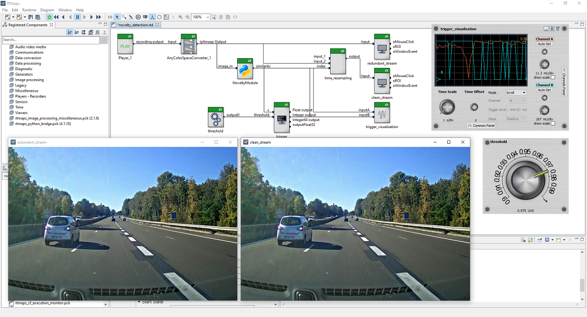

# Novelty Detection in RTMaps
This diagram showcases how to use an AI model to implement novelty detection inside RTMaps.
The model computes a feature vector for each image and compares it to subsequent images.
If a certain threshold is exceeded the new frame is passed, otherwise it is discarded.
This is an efficient and scalable way to reduce the number of uninformative frames for object detection tasks.

The "clean_stream" video only shows the frames above the novelty threshold, which may look like it is lagging, but it is not.
The threshold can be adjusted with the threshold potentiometer.

The "trigger_visualization" oscilloscope shows the novelty rating of the current frame (orange) and whether or not it passed the threshold (cyan).

