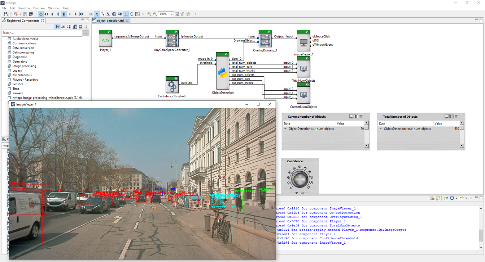

# Object Detection in RTMaps
This diagram showcases how to use an AI model to implement object detection inside RTMaps.
The model used here is a YOLO V3 network trained on the A2D2 dataset.
Found objects will be indicated by a colored box around the object.
The object types and corresponding colors are:

- car: red
- pedestrian: green
- truck: blue
- small vehicle: white
- utility vehicle: yellow
- bicycle: cyan
- tractor: purple

